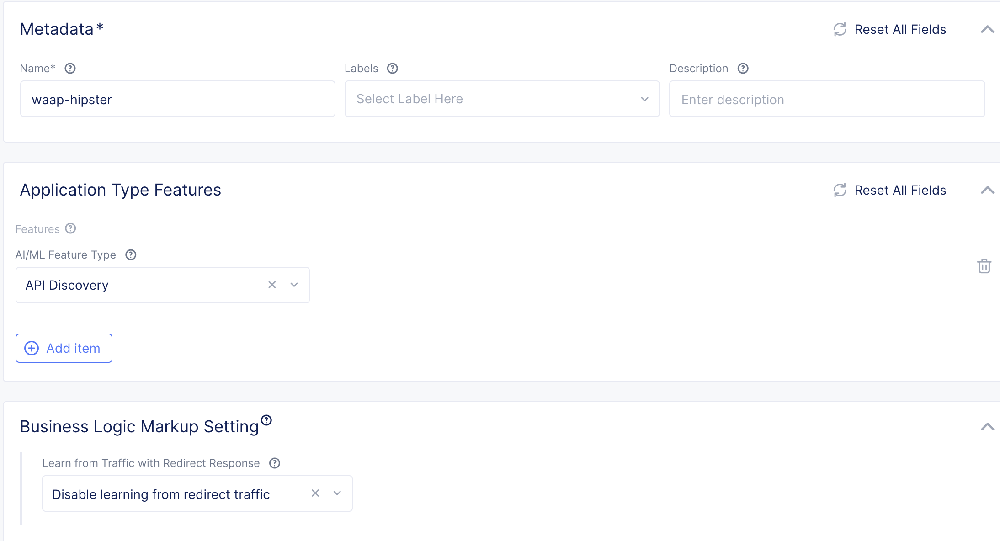

## AI & MLの作成

AI & MLはメトリックやログを元にデータの可視化や振る舞い検知を行います。`app setting`で作成したオブジェクト名をHTTP Load balancerやKubernetes Serviceのラベルに `ves.io/app_type: name`として設定すると、自動でデータを収集して解析します。

ここではGCPの[Microservices-demo](https://github.com/GoogleCloudPlatform/microservices-demo)でコールされるAPIを可視化するためにAI & ML の設定を行います。

** テナントの契約内容によってはAI & MLが使用できなかったり、従量課金で別途請求される場合があります。


## ハンズオンシナリオ

このハンズオンでは１つのCEを使用します。

手順

1. Siteの立ち上げ
1. Labelの設定
1. Virtual siteの作成
1. Virtual k8sの作成
1. Kubernetes Manifestの作成
1. API 可視化の設定
1. 振る舞い検知の設定

## Siteの立ち上げ

`vm-site1`をESXi上に構築します。
設定項目

* Hostname: `vm-site1`
* Certified hardware: `vmware-voltstack-combo`
* Token: `テナントのToken`
* Latitude, Longnitude: `任意の緯度経度`

## Virtual siteの作成

作成したSiteに`ce-type:waap`を設定します。


Virtual Siteを作成します。

- name: `waap-site`
- Site Type: `CE`
- Site Selector Expression: `ce-type:waap`


## Virtual k8sの作成

Virtual k8sを作成し、上記で作成したVirtual siteをセットします。
Virtual siteを確認すると、選択された実際のSiteを確認できます。

## Kubernetes Manifestの作成

vk8sのKubeconfigをダウンロードし、kubectlコマンドでKubenretes manifestを作成します。

``` bash
kubectl --kubeconfig ves_demo-japan_vk8s.yaml apply -f https://raw.githubusercontent.com/nakadaisuke/volterra-hands-on/master/yaml/hipstar.yaml
```

以下のようにすべてのManifestがCreatedになることを確認します。

```bash
deployment.apps/cartservice created
deployment.apps/checkoutservice created
deployment.apps/currencyservice created
deployment.apps/emailservice created
deployment.apps/frontend created
deployment.apps/loadgenerator created
deployment.apps/paymentservice created
deployment.apps/productcatalogservice created
deployment.apps/recommendationservice created
deployment.apps/redis-cart created
deployment.apps/shippingservice created
service/cartservice created
service/checkoutservice created
service/currencyservice created
service/emailservice created
service/frontend created
service/paymentservice created
service/productcatalogservice created
service/recommendationservice created
service/redis-cart created
service/shippingservice created
```

しばらくするとPodがRunningになります。

```bash
$ kubectl --kubeconfig ves_demo-japan_vk8s.yaml get po
NAME                                     READY   STATUS    RESTARTS   AGE
cartservice-5dd77589f6-ftfk9             2/2     Running   5          12m
checkoutservice-78db96459c-26l69         2/2     Running   0          12m
currencyservice-766f98cbfb-l2smv         2/2     Running   0          12m
emailservice-599b497dc9-x7vw5            2/2     Running   0          12m
frontend-c6bbf664d-d8sg6                 2/2     Running   0          12m
loadgenerator-866fcdfd55-cjwqw           2/2     Running   5          12m
paymentservice-bdc7f5649-j4fjh           2/2     Running   0          12m
productcatalogservice-c4f5c879c-2shff    2/2     Running   0          12m
recommendationservice-7856559c98-85v2g   2/2     Running   0          12m
redis-cart-7c97d9c455-htjp6              2/2     Running   0          12m
shippingservice-64f6696b4f-wpx9t         2/2     Running   0          12m

$ kubectl --kubeconfig ves_demo-japan_vk8s.yaml get svc
NAME                    TYPE        CLUSTER-IP        EXTERNAL-IP   PORT(S)     AGE
cartservice             ClusterIP   192.168.97.210    <none>        7070/TCP    12m
checkoutservice         ClusterIP   192.168.163.239   <none>        5050/TCP    12m
currencyservice         ClusterIP   192.168.227.159   <none>        7000/TCP    12m
emailservice            ClusterIP   192.168.148.18    <none>        5000/TCP    12m
frontend                ClusterIP   192.168.43.27     <none>        80/TCP      12m
paymentservice          ClusterIP   192.168.223.29    <none>        50051/TCP   12m
productcatalogservice   ClusterIP   192.168.159.40    <none>        3550/TCP    12m
recommendationservice   ClusterIP   192.168.83.25     <none>        8089/TCP    12m
redis-cart              ClusterIP   192.168.168.87    <none>        6379/TCP    12m
shippingservice         ClusterIP   192.168.160.233   <none>        50051/TCP   12m
```

## API可視化の設定

最初に `Shared` Namespaceの `Security` > `AI & ML` > `App types` からAI/MLで解析するアプリケーションタイプを設定します。
このシナリオではAPIの可視化を行うため、 `API Discovery`を設定します。

- name: `waap-hipster`
- AI/ML Feature Type: `API Discovery`



Kubernetes ServiceやHTTP LoadBalancerに、ここで作成したLabelを　`ves.io/app_type: waap-hipster` として設定するとMetricなどのデータを収集し、APIの可視化や振る舞い検知を行います。
この設定ではAPIの可視化のみ行います。　設定後に学習を行うため、10-20分程度時間がかかります。

Servie Meshから API Endpointsを開くとアプリケーションでコールされているAPIの一覧がグラフやテーブルリストとして表示されます。


## 振る舞い検知の設定

振る舞い検知はShared namespaceのApp Typesに設定を追加し、User namespaceにてAL＆MLのソースとなるデータを設定するだけで簡単に動作します。

Share namespaceのApp Typeでは以下のようなAnalysisを追加します。
- Timeseries Analysis
- Per API Request Analysis
- User Behavior Analysis

次にUser namespaceでAL＆MLの設定を行います。

- Name: `anomaly`
- AppType: `Shared/waap-hipster`
- Timeseries Analysis Setting: 任意のMetrics Sources
  - All Servides: Kubernetes ServiceのMetric
  - All Service Interactions: すべてのサービスの送信元送信先のMetric
  - All Viritual Hosts: Load BalancerのMetrics
- Include namespace in lerning: `Enable learning from this namespace`


学習には最低2-3時間必要です。学習されると、Service MeshのMetrics内に学習されたデータが半透明のグラフとなって表示されます。
普段と違う振る舞い（エラーやAPIコール数の急減など）が発生すると、対象時間のグラフが赤色でマークされます。


