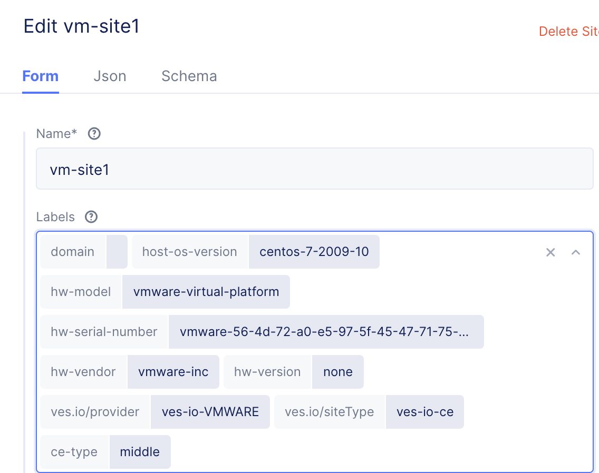
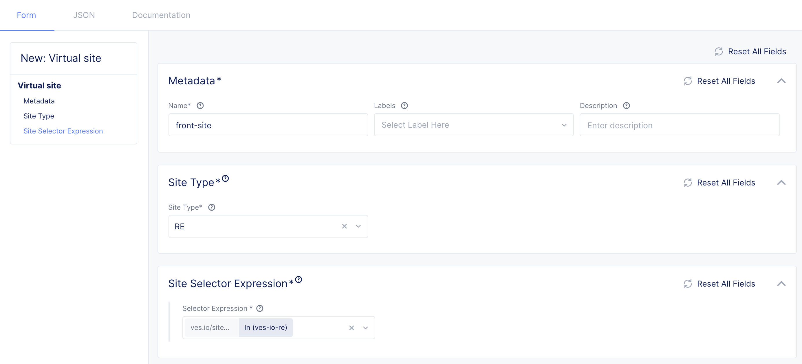

# Multi Cluster Service MeshとService Mesh Graph

VolterraではLoad balancerを使い、複数のKubernetes ClusterにまたがるService Meshを簡単に作成できます。
このハンズオンではIstioのBookinfo Applicationを複数のKubernetes clusterに分散配置し、アプリケーション間を連携させ動作させます。
以下の図は[Bookinfo](https://istio.io/latest/docs/examples/bookinfo/)のマイクロサービスを示しています。これら4つのサービスをProductpageはVoltrerraのREに配置し、Reviews,Details,RatingはCEに配置します。


## ハンズオンシナリオ

このハンズオンでは2つのCEと3つのVirtual siteを作成します。

CE
- vm-site1: `ce-type:middle`
- vm-site2: `ce-type:backend`

Virtual-site
- front-site: `ves.io/site:ves-io-re` # すべてのREを指定するプリセットのラベル
- middle-site: `ce-type:middle`
- backend-site: `ce-type:backend`

アプリケーション配置
- front-site: `Productpage`
- middle-site: `Reviews`, `Details`
- backend-site: `Ratings`

手順

1. Siteの立ち上げ
1. Labelの設定
1. Virtual siteの作成
1. Virtual k8sの作成
1. Kubernetes Manifestの作成
1. Origin poolの作成
1. Load Balancerの作成
1. 確認

## Siteの立ち上げ

`vm-site1`および `vm-site2`をESXi上に構築します。
設定項目

* Hostname: `vm-site1`または`vm-site2`
* Certified hardware: `vmware-regular-nic-voltmesh`
* Token: `テナントのToken`
* Latitude, Longnitude: `任意の緯度経度`

## Labelの設定

作成したSiteにそれぞれ`ce-type:middle`を`vm-site1`、`ce-type:backend`を`vm-site2`に設定します。



## Virtual siteの作成

Virtual Siteを3つ作成します。

- front-site: `ves.io/site:ves-io-re` # すべてのREを指定するプリセットのラベル
- middle-site: `ce-type:middle`
- backend-site: `ce-type:backend`

front-siteは`Site Type`で`RE`を選択し、`Site Selector Expression`でプリセットの`ves.io/site:ves-io-re`を選択します。
このラベルはVolterraのすべてのREが属しています。


残りの`middle-site`と`backend-site`はCEを選択して該当するラベルを指定します。



## Virtual k8sの作成

Virtual k8sを作成し、上記で作成した3つのVirtual siteをセットします。

Virtual siteを確認すると、選択された実際のSiteを確認できます。


## Kubernetes Manifestの作成

DeploymentとServiceを作成します。
サンプル内のAnnotationのNamespaceは環境に合わせて変更してください。

```
  annotations:
    ves.io/virtual-sites: demo-japan/middle-site
```

** `demo-japan`を環境に応じたNamespaceに変更

サンプルのYamlは[コチラ](<./yaml/bookinfo>)

作成するとProductpageはすべてのREでPodが動いているのが確認できます。


##  Origin poolの作成

作成したbookinfoワークロードをOrigin-poolに登録します。

### productpage

- Name: `productpage`
- Select Type of Origin Server: `k8sService Name of Origin Server on given Sites`
- Service Name: `productpage.namespace` ## サービス名.Naspaceのフォーマット
- Select Site or Virtual Site: Virtual Site: `Virtual site`
- Virtual site: `demo-japan/front-site`
- Select Network on the Site: `Vk8s Networks on Site`
- Port: `9080`


### details

- Name: `details`
- Select Type of Origin Server: `k8sService Name of Origin Server on given Sites`
- Service Name: `details.namespace` ## サービス名.Naspaceのフォーマット
- Select Site or Virtual Site: Virtual Site: `Virtual site`
- Virtual site: `demo-japan/middle-site`
- Select Network on the Site: `Vk8s Networks on Site`
- Port: `9080`

### reviews

- Name: `reviews`
- Select Type of Origin Server: `k8sService Name of Origin Server on given Sites`
- Service Name: `reviews.namespace` ## サービス名.Naspaceのフォーマット
- Select Site or Virtual Site: Virtual Site: `Virtual site`
- Virtual site: `demo-japan/middle-site`
- Select Network on the Site: `Vk8s Networks on Site`
- Port: `9080`

### ratings

- Name: `ratings`
- Select Type of Origin Server: `k8sService Name of Origin Server on given Sites`
- Service Name: `ratings.namespace` ## サービス名.Naspaceのフォーマット
- Select Site or Virtual Site: Virtual Site: `Virtual site`
- Virtual site: `demo-japan/backend-site`
- Select Network on the Site: `Vk8s Networks on Site`
- Port: `9080`

## Load Balancerの作成

クラスタ間連携を行うためにHTTP Loadbalancerを作成します。
本シナリオの場合、Productpageはインターネット、DetailsとReviewsはProductpage、RatingはRewiwsと連携するため、Advertiseするサイトはそれぞれ該当のVirtual siteを設定します。

### Productpage

- Name: `prouctpage`
- Domains: `cname` ## 最初にダミードメインを登録し、CNAMEが発行されたらCNAMEを入力
- Select Type of Load Balancer: `http`
- Default Origin Servers: `namespace/producpage`
- VIP Configuration: `On Internet`

### Details

- Name: `details`
- Domains: `details`
- Select Type of Load Balancer: `http`
- Default Origin Servers: `namespace/producpage`
- VIP Configuration: `Advirtise Custom` # VIP Configuration を有効化
- Select Where to Advertise: `virtual-site`
- Site Network: vK8s Service Network
- Virtual Site Reference: namespace/front-site

### Reviews

- Name: `reviews`
- Domains: `reviews`
- Select Type of Load Balancer: `http`
- Default Origin Servers: `reviews/producpage`
- VIP Configuration: `Advirtise Custom` # VIP Configuration を有効化
- Select Where to Advertise: `virtual-site`
- Site Network: vK8s Service Network
- Virtual Site Reference: namespace/front-site

### Reviews

- Name: `ratings`
- Domains: `ratings`
- Select Type of Load Balancer: `http`
- Default Origin Servers: `ratings/producpage`
- VIP Configuration: `Advirtise Custom` # VIP Configuration を有効化
- Select Where to Advertise: `virtual-site`
- Site Network: vK8s Service Network
- Virtual Site Reference: namespace/middle-site

サンプルのYamlは[コチラ](<./yaml/bookinfo-ves/>)

## 確認

作成したBookinfoに対してWebブラウザなどでアクセスを行うとBookinfoアプリが動作します。
何度かリロードを行うとRatingの情報が更新されます。

以下のようなスクリプトで数分アクセスを行うとService Mesh Graphが自動で作成されます。

``` bash
while true; do curl http://ves-io-df0b903c-6cdc-453d-ab44-788b1092ae89.ac.vh.ves.io/productpage?u=normal; done
```


サービスグラフのサービスをクリックすると情報が表示されます。
`Explore Service` をクリックするとサービスとロケーションのグラフに遷移します。


