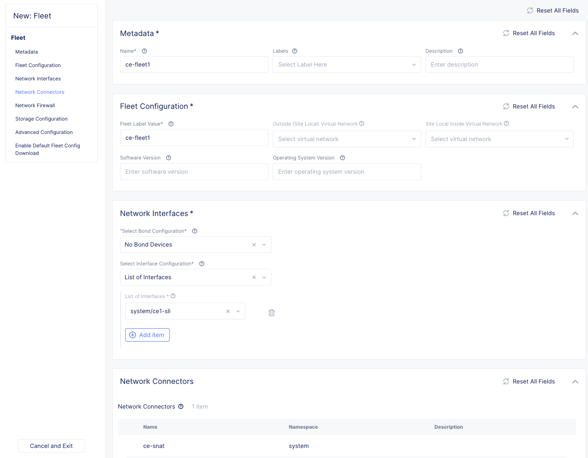

# サイトの作成

Volterraの[チュートリアル](<https://github.com/nakadaisuke/volterra-tutorial>)にあるように、様々な方法でインストールが可能です。このとき、複数のNICを持ったサイトの構築も可能です。

サイトはOutsideとInsideのインターフェイスをもし、OutsideはインターネットやVPNなどの外部接続用、Insideは端末などの接続用インターフェイスを示します。特殊用途としてStorage用インターフェイスも作成できます。

サイトのコンフィグは用途により2つの方法があります。

* Fleet
* VoltStack Site

Fleetは既存のサイトに対して設定値がプッシュされ追加インターフェイスやGPUなどがサイトに設定されます。
同じコンフィグをを複数のサイトに設定することも可能です。

VoltStack Siteは主に[マネージドKubernetes](<https://www.volterra.io/docs/services/volt-stack/managed-kubernetes>)のコンフィグを行います。StorageやKubernetes自体のコンフィグを行います。 VoltStack SiteはFleetを内部的に持っており、インターフェイスやGPUなどの設定をサイト作成前に作成し、VoltStack siteと同じクラスタ名のサイトをRegistration時にノードに設定します。
ノードのプロビジョニング時にFleetの情報などがプッシュされインターフェイスなどが設定されます。

VoltStack siteでは Inside interface (Site local inside)の設定はできないため、SD-WANのような複数インターフェイスを持ち、ネットワーク制御を行いたい場合はFleetを使用します。

Fleet

VoltStck Site

## Fleetの構成

Fleetは下図のようにFleetオブジェクトにネットワークやセキュリティオブジェクトを設定し、`ves.io/fleet`ラベルを持ったサイトにFleetオブジェクトが適用される動きになります。
`ves.io/fleet`は複数のサイトに設定することで共通のFleetオブジェクトを複数のサイトに一括設定できます。また共通のセキュリティポリシーを複数のFleetオブジェクトに設定することで、セキュリティポリシーを複数サイトに一括設定するなど柔軟なコンフィグが可能となります。

## Fleetを使ったサイトの構築

Fleetを使う場合でも通常と同じようにSiteを構築します。
このときマルチNICの場合はTokanなどを設定するときにMulti NIC対応のCertified hardwareを選択してください。

サイトが構築されたらFleetを作成します。

1. Virtual networkの作成 (オプション)
1. Network Interfaceの作成
1. Network Connectorの作成
1. Fleetの作成
1. Fleetラベルの設定

### Virtual networkの作成

Virtual networkはオプションです。共通サーバなどが設置されるネットワークに各Siteからアクセスさせたい場合などに`Global Network`の設定をするために使用します。

コンフィグ

- Name: `Virtual network名`
- Virtual Network Type: `Virtual networkのタイプを選択`

サンプルのYamlは[コチラ](<./yaml/virtual-network-1.yaml>)

### Network Interfaceの作成

Site local Inside側のインターフェイスを設定します。（Site local outsideは初期構築時に設定済み）
インターフェイスの設定はDHCP ClientやDHCP Serverなどで動作します。この例ではDHCP Serverで設定します。

コンフィグ

- Name: `Virtual interface名`
- Interface Type: `Ethernet Interface`
  - Ethernet Device: `eth1`
  - Select Interface Address Method: `DHCP Server`
    - DHCP Networks:
      - Select Network Prefix Method: `Network Prefix`
        - Network Prefix: `Network prefix`
  - Select Virtual Network: `Site Local Network Inside`

サンプルのYamlは[コチラ](<./yaml/virtual-interface-1.yaml>)

### Network Connectorの作成

Network Connectorはネットワーク同士の接続設定を行います。ルーティングではなく、Site local InsideからOutsideへの通信やGlobal Networkを接続することで、SNATやIPsecトンネルでの通信を行えるようにします。
ここではSite local Insideに接続される端末からSNATを行い、インターネットへ接続できるように設定します。

コンフィグ

- name: `Network connector名`
- Select Network Connector Type: `SNAT, Site Local Inside to Site Local Outside`
  - Routing Mode: `Default Gateway`
  - SNAT Source IP Selection: `Interface IP`

サンプルのYamlは[コチラ](<./yaml/network-connector-1.yaml>)

### Fleetの作成

作成したVirtual interfaceとNetwork connectorをFleetに設定します。
Fleet ConfigurationではSite Local Inside Virutal Networkなどが設定できますが、この設定は別シナリオで設定します。

コンフィグ

- name: `fleet名`
- Fleet Label Value: `ves.io/fleet 値` #この値がSiteに設定するLabel名になります。
- Select Interface Configuration: `List of Interfaces`
  - List of Interfaces: `作成したVirtual interfaceを選択`
- Network connectors: `作成したNetwork Connectorを選択`

サンプルのYamlは[コチラ](<./yaml/fleet-1.yaml>)

### Fleetラベルの設定

作成したFleetラベルをSiteのLabelに設定します。

Siteの`Node`画面を確認すると、Fleetで設定されたIPアドレスが確認できます。
クライアントを接続すると払い出しているIPアドレス情報なども表示されます。

