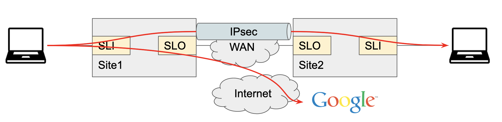
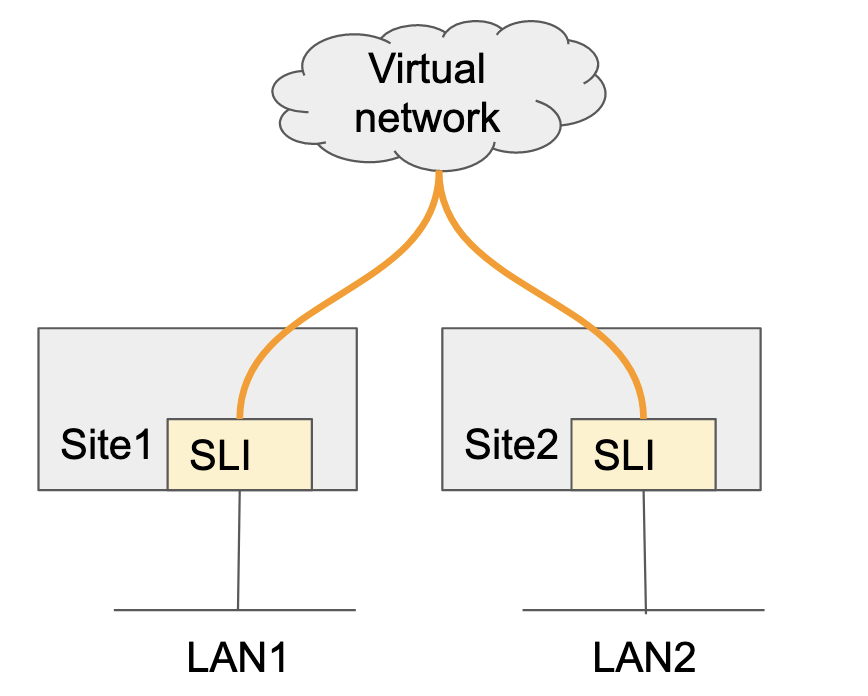
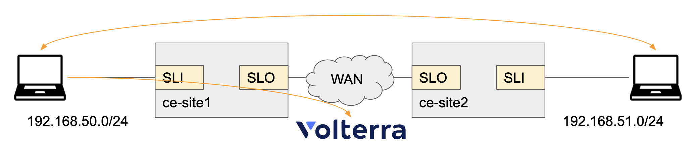
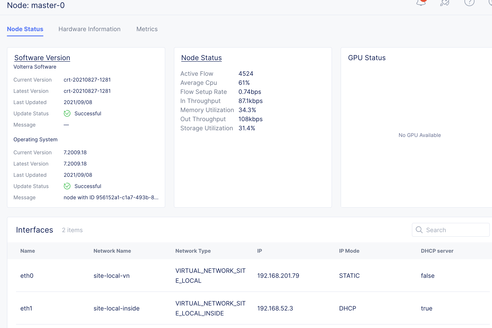
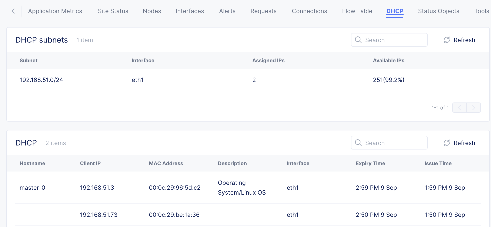
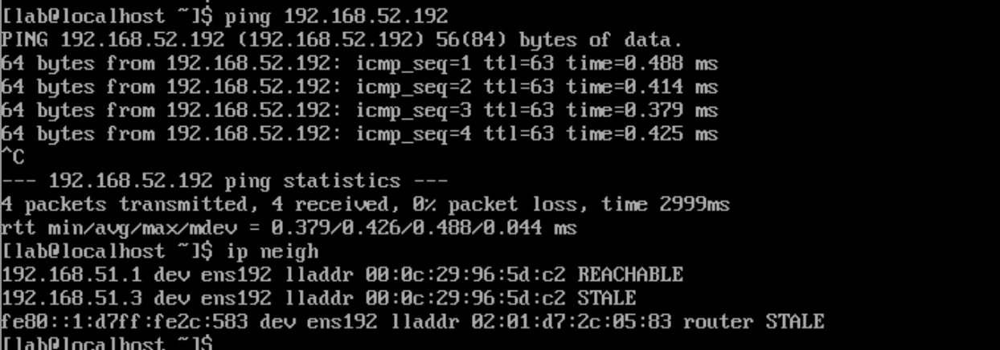

# Site to Siteの暗号化トンネル通信

このシナリオでは2つのサイトに接続した端末間の通信を暗号化トンネル（IPsec）で通信を行います。
また、インターネットはローカルブレイクアウトさせ、特定URLのみの通信を許可します。

設定はIPsec自体のコンフィグは行わず、ネットワーク接続の制御はVirtual networkとNetwork Connectorで行います。対象ネットワークがSLOの先にある場合、Site間で動的にIPsecトンネルを作成します。

VolterraではSite local Outside/Insideのネットワークを共通のVirtual networkに接続することで通信を可能にします。
Network connectorでVirtual Networkの設定を作成すると、該当Siteのインターフェイスのルーティング情報がVirtual networkに伝搬し、Site to Siteの通信が可能になります。

## ハンズオンシナリオ

2つのSiteを作成し、それぞれSite Local Insideにネットワークを接続します。それぞれのネットワークにはテスト用端末を接続します。テスト用端末にはDHCPでアドレスをアサインし、端末間の通信を行えるようにします。
また、インターネットの通信は特定宛先(volterra.io)のみ許可します。

手順

1. Siteの立ち上げ
1. Virtual networkの作成
1. Virtual interfaceの作成
1. Network connectorの作成
1. Fleetの作成
1. 端末のIPアドレス確認と疎通確認
1. Network firewallの作成と疎通確認
1. CE-CEの直接通信

## Siteの立ち上げ

`vm-site1`および `vm-site2`をESXi上に構築します。
設定項目

* Hostname: `vm-site1`または`vm-site2`
* Certified hardware: `vmware-regular-nic-voltmesh`
* Token: `テナントのToken`
* Latitude, Longnitude: `任意の緯度経度`

## Virtual networkの作成

端末同士を接続するためのVirtual networkを作成します。

設定項目

* name: `lan-nw`
* Select Type of Network: `Global Network`

## Virtual interfaceの作成

SLIに接続するVirtual interfaceを作成します。

設定項目

vm-site1用

* name: `vm-site1-eth1`
* Ethernet Interface:
  * Ethernet Device: `eth1`
* IP Configuration: `DHCP server`
  * DHCP Networks: 
    * Select Network Prefix Method: `Network Prefix`
      * Network Prefix: `192.168.51.0/24`
* Virtual Network: `Site Local Network Inside`

vm-site2用

* name: `vm-site2-eth1`
* Ethernet Interface:
  * Ethernet Device: `eth1`
* IP Configuration: `DHCP server`
  * DHCP Networks: 
    * Select Network Prefix Method: `Network Prefix`
      * Network Prefix: `192.168.52.0/24`
* Virtual Network: `Site Local Network Inside`

## Network connectorの作成

端末間の通信を許可するNetwork connectorを設定します。

設定項目

* name: `lan-nw`
* Select Network Connector Type: `Direct, Site Local Inside to a Global Network`
* Global Virtual Network: `lan-nw`

## Fleetの作成

作成したVirtual interfaceとNetwork connectorをFleetに紐付けます。

vm-site1用

* name: `vm-site1-fleet`
* Fleet Label Value: `vm-site1-fleet`
* Select Interface Configuration: `List of interfaces`
  * List of interfaces: `vm-site1-eth1`
* Network Connectors: `lan-nw`

vm-site2用

* name: `vm-site2-fleet`
* Fleet Label Value: `vm-site2-fleet`
* Select Interface Configuration: `List of interfaces`
  * List of interfaces: `vm-site2-eth1`
* Network Connectors: `lan-nw`

作成したラベルをSiteに設定します。

* vm-site1: Label: `ves.io/fleet: vm-site1-fleet`
* vm-site2: Label: `ves.io/fleet: vm-site2-fleet`

## 端末のIPアドレス確認と疎通確認

SiteはSite listから該当サイトをクリックと詳細が表示されます。
Nodeの中にはインターフェイスのIPアドレスが表示され、DHCPには端末などに払い出されたIPアドレスの確認ができます。

端末からPingを発行すると通信できることが確認できます。

このままではインターネットには接続できないため、インターネット接続用のNetwork connectorを作成し、Fleetに追加します。

設定項目

* name: `internet-snat`
* Select Network Connector Type: `SNAT, Site Local Inside to Site Local Outside`

## Network firewallの作成と疎通確認

インターネット向け通信は特定URL `volterra.io` のみ許可します。

設定項目

Network connector `internet-snat`で以下を変更します。

* Select Forward Proxy：`Enable Forward Proxy`

SecurityのForward proxy policyを設定します。

* Name: `allow-urls`
* Select Forward Proxy: `Network Connector`
  * Network Connector: `system/internet-snat`
Select Policy Rules: `Allowed connections`
  * TLS Domains:
    * Enter Domain: `Suffix Value`
      * Suffix Value: `volterra.io`
  * HTTP URLs:
    * Enter Domain: `Suffix Value`
      * Suffix Value: `volterra.io`

Netwrok ConnectorでProxy Configurationを有効にします。

* Select Forward Proxy: `Enable Forward Proxy`

Network Firewall に作成したForward Proxyを設定します。

* name: `nw-firewall1`
* Select Foward Policy Configuration: `Active Forward Proxy Policies`
  * Forward Proxy Policies: `system/allow-urls`

作成したNetwork FirewallをFleet `vm-site1-fleet` に設定します。

* Network Firewall: `system/nw-firewall1`

端末からCurlで`volterra.io`以外のドメインには通信できないことを確認します。

