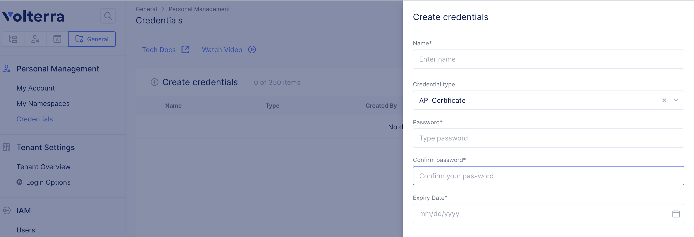

# vesctlの使い方

vesctlはVolterraのAPIラッパーです。kubectlのようにコマンドラインでVolterraのAPIを簡単に利用することができます。
vesctlは
[vesctl download](https://gitlab.com/volterra.io/vesctl/-/releases)
からダウンロードが可能です。

vesctlのインストールはダウンロードしたパッケージを解答し、実行権限を付与し、任意のディレクトリにコピーします。
以下の例では `/usr/local/bin`にインストールしています。

```
gzip -d vesctl.darwin-amd64.gz
chmod +x vesctl.darwin-amd64
cp vesctl.darwin-amd64 /usr/local/bin/
```

vesctl動作確認します。場合によってはOSのセキュリティ設定などが必要です。

```
vesctl.darwin-amd64 -h
A command line utility to interact with ves service.

Usage:
  vesctl [command]

Available Commands:
  completion    Generate completion script
  configuration Configure object
  help          Help about any command
  request       Execute Commands
  site          Manage site creation through view.aws_vpc apis
  version       Print build version
```

接続にはVoltConsoleでp12ファイルの取得が必要です。
API接続用のクレデンシャルはVoltConsoleのGeneralから取得できます。



`HOME/.vesconfig` に接続先URLとp12ファイルを保存したディレクトリを設定します。

```
server-urls: https://yourtenant.console.ves.volterra.io/api
p12-bundle: /Users/dnakajima/Documents/volt-field.console.ves.volterra.io.api-creds.p12
```

p12ファイルのパスワードをExportし、vesctlコマンドを実行するとVoltConsoleのAPIを操作できます。

```
export VES_P12_PASSWORD=yourpassword

vesctl.darwin-amd64 configuration list namespace
+-----------+---------------------+--------+
| NAMESPACE |        NAME         | LABELS |
+-----------+---------------------+--------+
| <None>    | default             | <None> |
+-----------+---------------------+--------+
| <None>    | shared              | <None> |
+-----------+---------------------+--------+
| <None>    | system              | <None> |
+-----------+---------------------+--------+
```
